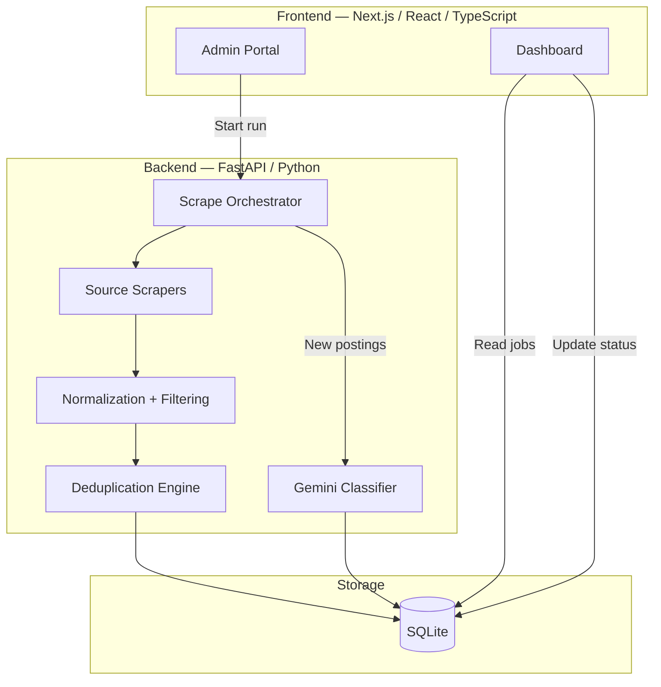

# Job Aggregator

Job Aggregator is a full-stack application for collecting, normalizing, deduplicating, and reviewing software-related job postings from multiple Sri Lankan job platforms. It combines a FastAPI backend with a Next.js frontend so users can trigger scrapes, monitor progress, and review processed jobs from a single dashboard.


---

## Overview

The project is designed for practical job-market monitoring rather than continuous scraping. A user can start a scrape run manually from the admin interface, collect listings from enabled sources, and review them in a unified dashboard. The system handles source-specific scraping, normalization, duplicate detection, optional AI-based relevance classification, and basic application-state tracking.

Key capabilities include:

- Aggregation from multiple job platforms through dedicated scrapers
- Deduplication across sources and repeated postings
- Keyword-based filtering for role relevance
- Optional Gemini-based relevance classification for borderline matches
- A dashboard for browsing and filtering jobs
- An admin interface for triggering runs, viewing history, and toggling sources

---

## Features

- Multi-source aggregation from 9 supported platforms
- Source-specific scraper modules with shared retry and rate-limiting behavior
- Normalization and role-keyword filtering before results reach the UI
- Duplicate detection and merge logic to avoid repeated listings
- Manual scrape orchestration with live progress updates and cancellation support
- Scrape history and per-site results tracking
- Application-state workflow for marking jobs as applied, removed, or restored
- Source and keyword configuration through the admin area

---

## Tech Stack

### Frontend

- Next.js with App Router
- React and TypeScript
- Tailwind CSS for styling
- A component-based admin and dashboard experience

### Backend

- FastAPI
- SQLModel and SQLite for persistence
- httpx, BeautifulSoup4, curl_cffi, and Playwright for scraping
- Google Gemini for optional AI-based classification

---

## Architecture



The flow is straightforward: the admin UI starts a scrape run, the orchestrator executes enabled scrapers, results are normalized and deduplicated, and new jobs can be classified before they are shown in the dashboard.

---

## Project Structure

```text
job-aggregator/
├── backend/
│   ├── app/
│   │   ├── main.py
│   │   ├── config.py
│   │   ├── db.py
│   │   ├── models.py
│   │   ├── normalize.py
│   │   ├── dedup.py
│   │   ├── classifier.py
│   │   ├── orchestrator.py
│   │   ├── routers/
│   │   └── scrapers/
│   └── requirements.txt
├── frontend/
│   ├── package.json
│   └── src/
│       ├── app/
│       ├── components/
│       └── lib/
└── README.md
```

---

## Getting Started

### Prerequisites

- Python 3.11+
- Node.js 18+
- A Google Gemini API key if AI classification is enabled

### Backend Setup

```bash
cd backend
python -m venv venv
# Windows
venv\Scripts\Activate.ps1
# macOS / Linux
source venv/bin/activate
pip install -r requirements.txt
```

Start the API:

```bash
uvicorn app.main:app --reload
```

The backend will be available at http://localhost:8000.

### Frontend Setup

```bash
cd frontend
npm install
npm run dev
```

The dashboard is served at http://localhost:3000 by default.

### Environment Variables

Create a backend environment file with the values required by the application, including:

- `GEMINI_API_KEY` for AI-based classification
- `USER_AGENT` for scraper identification
- `DEFAULT_RATE_LIMIT_SECONDS` for request spacing
- `CORS_ORIGINS` for frontend access
- `DATABASE_URL` if a custom SQLite path is needed

---

## Usage

1. Open the admin portal at /admin.
2. Start a scrape run for all sources or a specific source.
3. Monitor per-site progress and scrape history.
4. Review the consolidated job list in the dashboard.
5. Update job status as needed during review.

---

## Responsible Use

This project is intended for personal or internal use and should be operated responsibly. The application uses rate limiting and manual trigger behavior to reduce unnecessary load on target sites. Please review the terms of service and access policies of each source before using or extending the scrapers.

---

## Contributing

Contributions are welcome. If you would like to improve the scrapers, add sources, refine the UI, or strengthen the backend logic, feel free to open an issue or submit a pull request.
