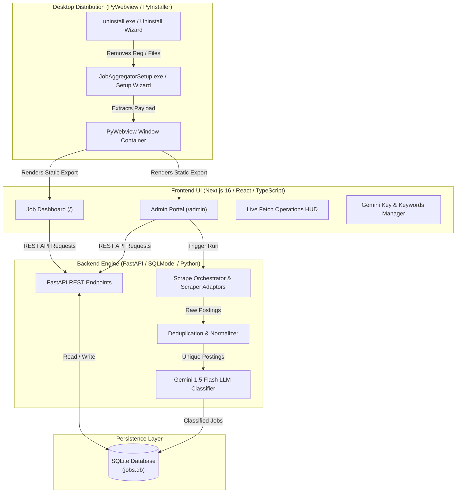

# Job Aggregator — Sri Lanka Software Engineering Job Engine

> A full-stack, multi-source job aggregation, normalization, deduplication, and AI relevance classification engine built for Sri Lanka's software engineering job market.

[](backend/README.md)
[](frontend/README.md)
[](backend/README.md)
[](desktop/README.md)
[](LICENSE)

---

## Executive Overview

**Job Aggregator** simplifies job hunting for software engineers in Sri Lanka by consolidating listings from major platforms (`rooster.jobs`, `topjobs.lk`, `itpro.lk`, `lk.indeed.com`, `glassdoor.com`, `careers.lk`, `expressjobs.lk`, `observerjobs.lk`, `jobkart.lk`) into a single unified workspace.

Instead of endlessly checking multiple websites, Job Aggregator provides:
- **Multi-Source Aggregation**: Automated scraping using specialized adaptors tailored per site structure.
- **Intelligent Deduplication**: Merges duplicate listings posted across multiple sites or re-advertised postings.
- **Role-Based Normalization & Filtering**: Cleans titles, extracts experience levels, and filters for relevant engineering roles.
- **Gemini 1.5 Flash AI Classifier**: Uses Google Gemini LLM to evaluate borderline postings and eliminate non-tech jobs.
- **Kanban Application Tracker**: Track application states (`SAVED`, `APPLIED`, `INTERVIEWING`, `REMOVED`) directly from the dashboard.
- **Dual Operating Modes**: Run as a standard **Web Application** (Next.js + FastAPI) or as a native **Windows Desktop Application** (`JobAggregatorSetup.exe`).

---

## Master Architecture & Sub-projects

Job Aggregator is architected into three interconnected sub-projects:



---

## Repository Structure & Sub-project Documentation

Click into any sub-project below for in-depth technical documentation:

### 📁 [1. Backend Engine (`backend/ README.md`)](backend/README.md)
*Contains the FastAPI server, scraper adaptors (`httpx`, `BeautifulSoup4`, `curl_cffi`, `Playwright`), database models (`jobs.db`), deduplication logic, and Gemini AI integration.*

### 📁 [2. Frontend Web Application (`frontend/ README.md`)](frontend/README.md)
*Contains the Next.js 16 App Router interface, React components, dark glassmorphism styling, Kanban application state controls, real-time fetch HUD, and Gemini settings UI.*

### 📁 [3. Desktop Distribution (`desktop/ README.md`)](desktop/README.md)
*Contains the PyWebview desktop wrapper, PyInstaller specs, setup installer GUI (`installer_gui.py`), uninstaller GUI (`uninstaller_gui.py`), and binary packaging tools.*

---

## Tech Stack Summary

| Layer | Technology | Details |
| :--- | :--- | :--- |
| **Frontend UI** | Next.js 16, React 19, TypeScript | App Router, static export (`output: "export"`) |
| **Styling** | Vanilla CSS Tokens | Dark glassmorphic design system in `globals.css` |
| **Backend API** | FastAPI, Uvicorn, SQLModel | Async REST endpoints, Pydantic data validation |
| **Scrapers** | HTTPX, BeautifulSoup4, curl_cffi, Playwright | Dynamic site rendering, rate-limiting & retries |
| **AI Classification** | Google Gemini 1.5 Flash | Structured JSON prompt classification for role relevance |
| **Database** | SQLite | Saved at `backend/jobs.db` (dev) or `%APPDATA%\JobAggregator\jobs.db` (desktop) |
| **Desktop Wrapper** | PyWebview 5.4, PyInstaller | Native Windows GUI application with installer & uninstaller wizards |

---

## Getting Started

### Mode A: Web Development Setup

#### 1. Backend Server
```powershell
cd backend
python -m venv venv
.\venv\Scripts\Activate.ps1   # Windows PowerShell
pip install -r requirements.txt
python -m uvicorn app.main:app --host 127.0.0.1 --port 8000 --reload
```
*Backend runs at `http://127.0.0.1:8000` (Swagger UI at `http://127.0.0.1:8000/docs`).*

#### 2. Frontend Web Server
```bash
cd frontend
npm install
npm run dev
```
*Dashboard served at `http://localhost:3000` (Admin Portal at `http://localhost:3000/admin`).*

---

### Mode B: Native Windows Desktop Setup

#### 1. Build Desktop Package from Source
```powershell
cd desktop
pip install -r requirements.txt

# 1. Build application payload
python -m PyInstaller -y build.spec

# 2. Build standalone uninstaller
python -m PyInstaller -y uninstaller_build.spec

# 3. Bundle uninstaller into payload
copy dist\uninstall.exe dist\JobAggregator\uninstall.exe

# 4. Build single installer setup file
python -m PyInstaller -y installer_build.spec
```

#### 2. Install & Run
- Double-click **`desktop/dist/JobAggregatorSetup.exe`** to launch the 3-step installer GUI.
- Follow the setup wizard to create Desktop/Start Menu shortcuts and configure Developer Mode.
- Open **Job Aggregator** from your Desktop or Start Menu!

---

## Environment Configuration

When running in web dev mode, create a `backend/.env` file:

```ini
GEMINI_API_KEY=your_google_gemini_api_key
USER_AGENT=Mozilla/5.0 (Windows NT 10.0; Win64; x64)
DEFAULT_RATE_LIMIT_SECONDS=1.0
CORS_ORIGINS=http://localhost:3000,http://127.0.0.1:3000
```

> 💡 **Desktop Note**: When using the desktop app, you do **not** need a `.env` file. Simply enter your Gemini API key inside the **Admin Portal → Application Settings** page; it is stored securely in your local `%APPDATA%\JobAggregator\jobs.db` database.

---

## License & Responsible Usage

Distributed under the MIT License. Scrape operations are designed for personal job monitoring and include configurable rate-limiting and user-agent settings. Please respect the terms of service of individual job platforms when running scrape pipelines.
